<div align="center">



<br/><br/>

[](https://akshobya.vercel.app)
&nbsp;
[](https://www.linkedin.com/in/akshobya-rao-a852a0361/)
&nbsp;
[](https://github.com/AkshobyaRaoSWE)

</div>

<br/>

## &nbsp;About

```python
class AkshobyaRao:
    def __init__(self):
        self.role     = "Mechanical Engineering–bound"
        self.school   = "Neuqua Valley HS · Naperville, IL"
        self.team     = "VEX 2360C 'Clockwork' — Lead Programmer"
        self.writes   = ["odometry", "pure pursuit", "PID", "C++ (PROS / LemLib)"]
        self.learning = "Python for engineering simulation"
        self.speaks   = "Competitive Special Occasion Speaking"

    def say_hi(self):
        return "Thanks for stopping by — projects are below."
```

- &nbsp;Lead programmer for **VEX 2360C "Clockwork"** — odometry, path following, PID tuning
- &nbsp;**Illinois State Runners-Up** & **VEX Worlds Qualifier** (2026)
- &nbsp;Drawn to control systems, motion planning, and physics simulation
- &nbsp;Currently building **Fifty Labs** — a creative design agency
- &nbsp;Off the keyboard: competitive public speaker

<br/>

## &nbsp;Toolbox

<div align="center">

[](https://skillicons.dev)


</div>

<br/>

## &nbsp;Projects

| | Project | What it is |
| :-- | :-- | :-- |
| 🤖 | **[VEX 2360C "Clockwork"](https://github.com/AkshobyaRaoSWE/2360C)** | Autonomous robot code — odometry, pure pursuit, PID. The brain behind a Worlds-qualifying robot. |
| 🧼 | **[removebg](https://github.com/AkshobyaRaoSWE/removebg)** | A free, open-source background remover — no ads, no paywall. |
| 🔄 | **[file_converter](https://github.com/AkshobyaRaoSWE/file_converter)** | Convert files for free, with no ads. |
| 🔣 | **[regex_tester](https://github.com/AkshobyaRaoSWE/regex_tester)** | A clean regex tester for anyone who needs one. |
| 🎨 | **[image_color_picker](https://github.com/AkshobyaRaoSWE/image_color_picker)** | Pull the colors out of any image. |

<div align="center">

**Live on the web** &nbsp;·&nbsp; [Portfolio](https://akshobya.vercel.app) &nbsp;·&nbsp; [StudentTeachers](https://studentteachers.dev) &nbsp;·&nbsp; [Illinois Robotics Education Foundation](https://www.ilref.org) &nbsp;·&nbsp; [Fifty Labs](https://fifty-labs.vercel.app)

<br/><br/>

[](https://akshobya.vercel.app)

<sub><i>Built with curiosity and too many late-night autonomous runs.</i></sub>

</div>
