&nbsp;

&nbsp;

&nbsp;

## &nbsp;`signal > noise`

I'm a future engineer in Naperville working across three lanes: **mechanical systems that move**,
**sensors that read the body without a needle**, and **the software that ties them together.**
Same move underneath all of them, take a messy, complex system and pull one clean signal out of it, fast.

<table>
<tr>
<td width="33%" valign="top">

### ⚙️ Mechanical engineering
Vehicle dynamics, robotics, telemetry. Formula 1 is where it gets loud, finding pace where everyone else sees noise.

</td>
<td width="33%" valign="top">

### 🧬 Biotechnology
Non-invasive health tech. Cheap, simple tools that finally read what the body broadcasts.

</td>
<td width="33%" valign="top">

### 💻 Software
The connective tissue, data pipelines, simulation, and the interfaces that make the other two usable.

</td>
</tr>
</table>

## &nbsp;`stack`

    

## &nbsp;`telemetry`

## &nbsp;`projects`

| | Project | What it is | |
| :-- | :-- | :-- | :-- |
| 🏎️ | **[Formula 1 Lab](https://akshobya.vercel.app)** | Telemetry viewer, a stewards' decision log, a fantasy lab, and a helmet gallery. |  |
| 🎓 | **[StudentTeachers](https://studentteachers.dev)** | A nonprofit I founded and shipped the whole site for. |  |
| 🎨 | **[Fifty Labs](https://fifty-labs.vercel.app)** | My design studio. Bold, performant sites. |  |
| 🤖 | **[VEX 2360C](https://github.com/AkshobyaRaoSWE/2360C)** | Autonomous robot code in C++: odometry, pure pursuit, PID. |  |
| 🧼 | **[removebg](https://github.com/AkshobyaRaoSWE/removebg)** | A free, open-source background remover. |  |
| 🔄 | **[file_converter](https://github.com/AkshobyaRaoSWE/file_converter)** | Convert files free, no ads. |  |

### `let's talk`

&nbsp;

<i>machines that move, sensors that listen, software that ties it together.</i>

